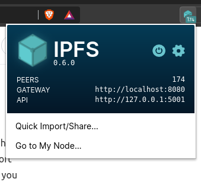

# IPFS Companion

IPFS Companion allows you to interact with your IPFS node and the extended IPFS network through your browser. The add-on is available for Brave, Chrome, Edge, Firefox, and Opera. It enables support for `ipfs://` addresses, automatically loads websites and file paths from an IPFS gateway, allows you to easily import and share a file with IPFS, and more.

IPFS Companion works in tandem with an IPFS node running on your local machine, so make sure you have a [node installed](./ipfs-desktop) before installing this add-on.

## Install

The easiest way to install IPFS Companion is through your browser's add-on store:

|  [Firefox](https://www.mozilla.org/firefox/new/) \| [Firefox for Android](https://play.google.com/store/apps/details?id=org.mozilla.firefox)   |  [Chrome](https://www.google.com/chrome/) \|  [Brave](https://brave.com/) \|  [Opera](https://www.opera.com/) \|  [Edge](https://www.microsoftedgeinsider.com/) |
| ------------------------------------------------------------------------------------------------------------------------------------------------------------------------------------------------------------------------------------------- | ----------------------------------------------------------------------------------------------------------------------------------------------------------------------------------------------------------------------------------------------------------------------------------------------------------------------------------------------------------------------------------------------------------------------------------------------------------------------------------------------------------------------------------- |
| [ ](https://addons.mozilla.org/firefox/addon/ipfs-companion/) | [ ](https://chrome.google.com/webstore/detail/ipfs-companion/nibjojkomfdiaoajekhjakgkdhaomnch)                                                                                                                                                                                               |

Make sure you have [IPFS installed](https://ipfs.io/#install) on your computer as well. Because IPFS Companion (in its standard configuration) talks to your computer's local IPFS node to work its browser magic, you'll need to have IPFS running on your computer, too.

### Beta and development channels

If you're looking for a more current or bleeding-edge version of IPFS Companion, check out how to use the beta or development channels in the [project's GitHub repository](https://github.com/ipfs-shipyard/ipfs-companion)!

## Features

IPFS Companion supercharges your browser for the DWeb with features including the following:

### Detect URLs with IPFS paths

IPFS Companion detects and tests requests for IPFS-like paths, such as `/ipfs/{cid}` or `/ipns/{peerid_or_host-with-dnslink}`, on any website. If a path is a valid IPFS address, it is redirected to load from your local gateway. The gateway at `localhost` will also automatically switch to a subdomain to provide a unique origin for each website:

> `https://ipfs.io/ipfs/QmbWqxBEKC3P8tqsKc98xmWNzrzDtRLMiMPL8wBuTGsMnR`  
> → `http://localhost:8080/ipfs/QmbWqxBEKC3P8tqsKc98xmWNzrzDtRLMiMPL8wBuTGsMnR`
> → `http://bafybeigdyrzt5sfp7udm7hu76uh7y26nf3efuylqabf3oclgtqy55fbzdi.ipfs.localhost:8080`

### Detect DNSLink-enabled URLs

IPFS Companion detects DNSLink info in the DNS records of websites. If a site uses DNSLink, IPFS Companion redirects the HTTP request to your local gateway:

> `http://docs.ipfs.io`  
> → `http://localhost:8080/ipns/docs.ipfs.io` → `http://docs.ipfs.io.ipns.localhost:8080/`

### Detect pages with `x-ipfs-path` headers

IPFS Companion also upgrades transport to IPFS if it finds the `x-ipfs-path` in any HTTP response headers. This acts as a fallback for cases when an IPFS path is not present in the URL.

### Toggle redirects globally or per site

You can disable and re-enable local gateway redirects in several ways:

- Suspend redirects globally in IPFS companion's preferences.
- Suspend redirects per site using the toggle under the _current tab_ or in IPFS companion's preferences.
- Add `x-ipfs-companion-no-redirect` to the URL itself as a hash.

### Access frequently-used IPFS actions from your browser bar

IPFS Companion enables you to quickly and easily access common actions from your browser bar with just a few clicks:

- See how many peers you're connected with a glance at the cube icon in your browser bar.
- Check your IPFS API and gateway status by clicking the cube icon to reveal the main menu.
- Right-click images and other page assets to easily add them to IPFS, including the option to preserve file names.
- Choose the _Quick Import/Share..._ option in the main menu for quick drag-and-drop import from a browser tab.
- Pin or unpin IPFS resources directly from the main menu.
- Copy shareable public gateway links, IPFS content paths, or CIDs of IPFS resources directly from the main menu.
- Launch the [IPFS Web UI dashboard](https://github.com/ipfs-shipyard/ipfs-webui) from the main menu with a single click.
- Toggle gateway redirects or switch all IPFS companion features on or off quickly and easily from the main menu.

## Further documentation

If you want to delve deeper into IPFS Companion, check out the project's documentation at [github.com/ipfs-shipyard/ipfs-companion →](https://github.com/ipfs-shipyard/ipfs-companion)
